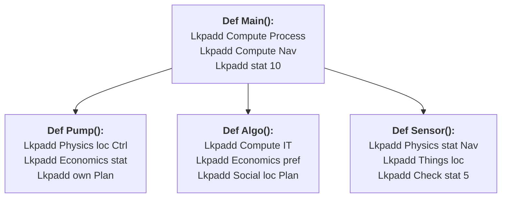

# Function tree

One main function with three functions below it. Each box holds text for the
Text board of `text_board.py`.

```mermaid
flowchart TD
    main["<b>Def Main():</b><br/>Lkpadd Compute Process<br/>Lkpadd Compute Nav<br/>Lkpadd stat 10"]
    pump["<b>Def Pump():</b><br/>Lkpadd Physics loc Ctrl<br/>Lkpadd Economics stat<br/>Lkpadd own Plan"]
    algo["<b>Def Algo():</b><br/>Lkpadd Compute IT<br/>Lkpadd Economics pref<br/>Lkpadd Social loc Plan"]
    sensor["<b>Def Sensor():</b><br/>Lkpadd Physics stat Nav<br/>Lkpadd Things loc<br/>Lkpadd Check stat 5"]

    main --> pump
    main --> algo
    main --> sensor
```
